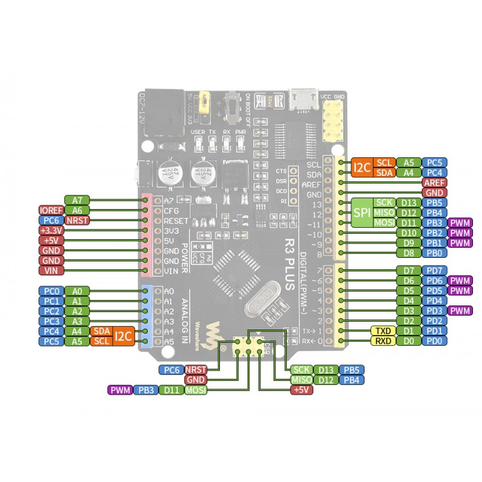
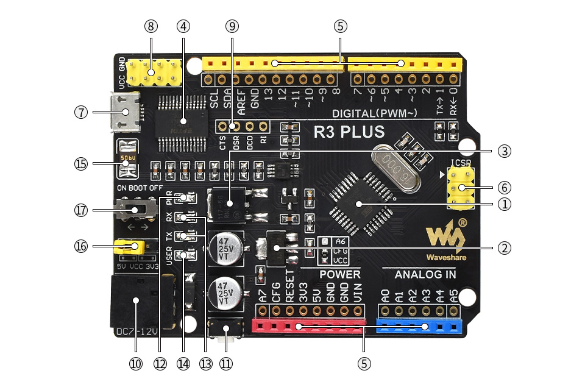

# Sterowanie jasnością diody w zależności od intensywności odbieranego dźwięku
## Opis
>Mikrofon przesyła odebrany dźwięk do mikrokontrolera, ten natomiast steruje jasnością diody w zależności od poziomu odebranego sygnału.
***
## Urzadzenia
- **wejściowe:** mikrofon
- **wyjściowe:** dioda
***
## Lista elementów
1. [Płytka rozwojowa](https://kamami.pl/plytki-zgodne-z-arduino-inne/584351-r3-plus-plytka-rozwojowa-z-mikrokontrolerem-atmega328p.html)

Cechy:

>Mikrokontroler:	ATmega328
>
>Rdzeń:	AVR
>
>Częstotliwość układu:	16 MHz
>
>Pamięć Flash:	32 kB
>
>Pamięć RAM:	2 kB
>
>Pamięć EEPROM:	1 kB
>
>Ilość pinów cyfrowych:	20
>
>Ilość kanałów PWM:	6
>
>Ilość wejść analogowych:	8
>
>Przetwornik ADC:	1x 10bit
>
>Interfejs USB:	1
>
>Napięcie logiki:	3,3 V/5 V
>
>Napięcie zasilania: od	7 V
>
>Napięcie zasilania: do	12 V

Opis portów:

>1. Mikrokontroler ATmega328P-AU
>2. Stabilizator 3,3 V AMS1117-3.3
>3. Stabilizator 5 V NCP1119ST50T3G
>4. FT232RL
>5. Interfejs Arduino
>6. Interfejs ICSP
>7. Złącze microUSB
>8. Piny z zasilaniem
>9. Piny FT232
>10. Wejście zasilania DC 7-12 V
>11. Reset
>12. LED zasilania
>13. LED TX/RX
>14. LED użytkownika
>15. Bezpiecznik 0,5 A
>16. Konfiguracja zasilania
>17. Przełącznik trybu Bootloader-a

2. [Płytka stykowa](https://kamami.pl/plytki-stykowe/557415-prototypowa-plytka-stykowa-170-punktow-35x47-mm-kolor-bialy.html)
3. [Mikrofon](https://kamami.pl/moduly-z-mikrofonami-i-detektory-dzwieku/560196-modul-czujnika-dzwieku-waveshare.html)
4. [Przewody M-M](https://kamami.pl/przewody-m-m/204597-przewody-m-m-roznokolorowe-17-cm-do-plytek-stykowych-40-szt.html)
5. [Dioda Led](https://kamami.pl/jednokolorowe/199221-led-al-o50y-w00900-130-70.html)
6. Rezystor

***
## Etap 1

- Temat projektu
- Opis
- Lista elementów

