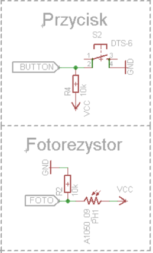
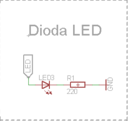

# Temat: Zapalanie diody w zależności od oświetlenia pomieszczenia
# Opis ogólny
>Na podstawie infomrmacji otrzymanych z fotorezystor dotyczących jasności otoczenia, mikropocesor zapala bądź gasi diodę RGB.
# Urzadzenia
- **wejściowe:** fotorezystor, przycisk
- **wyjściowe:** dioda

# Lista elementów
## Sekcja mikroprocesora

### 1.  Mikroprocesor - ATmega328P

<b>Parametry Techniczne</b>

Producent: ATMEL

Typ ukadu scalonego: mikrokontroler AVR

Organizacja pamici Flash: 32kx8bit

Pojemno pamici EEPROM: 1024B

Pojemno pamici SRAM: 2048B

Czstotliwo taktowania: 20MHz

Liczba wej/wyj:	23 

Liczba kanaw PWM: 6 

Liczba timerw 8-bit: 2 

Liczba timerw 16-bit: 1 

Napicie pracy: 1.8...5.5V

<b>Opis portów:</b>


***

### 2.  Rezonator kwarcowy 16 MHz

***
## Sekcja wejściowa

### 1.  Przełącznik DTS-6 (przycisk typu tact switch)
Naciśnięcie powoduje zwarcie styków, zwolnienie rozwiera styki.


***
### 2.  Fotorezystor
Fotorezystor zmienia swoją czułość w zależności od długości fali światła padającego na niego. Co za tym idzie jest w stanie monitorować oświetlenie w miejscu, w którym się znajduje.

## Sekcja wyjściowa

### 1.  Dioda LED RGB
# Kod
```cpp
#include <avr/io.h>
#include <util/delay.h>

// deklaracja zmiennych globalnych
#define button (1<<PC5)
#define PWM_LED (1<<PB1)

// deklaracja PWM
void init_PWM(){
	TCCR1A |= (1<<COM1A1) | (1<<WGM10); // TCCR1A - rejestr konfiguracyjny A
	TCCR1B |= (1<<WGM12) | (1<<CS11); // TCCR1B - rejestr konfiguracyjny B
	OCR1A = 0; // OCR1A - pierwszy rejestr funkcji Output Compare, dostępny 8-bitowo
}

// deklaracja ADC
void init_ADC(){
	ADMUX |= (1 << REFS0); // ADMUX - rejestrów sterujących zachowaniem się przetwornika
	// REFS0 - Wybór źródła napięcia odniesienia
	ADCSRA |= (1 << ADPS1) | (1 << ADPS0); // ADCSRA - rejestrów sterujących zachowaniem się przetwornika
	// ADPS0, ADPS1 - bity definujące pożądaną relację między częstotliwością zegara sytemowego
	ADCSRA |= (1 << ADEN); 
	// ADEN - ustawienie go zezwala na pracę przetwornika, a wyzerowanie wyłącza go. Wyłączenie ADC podczas wykonywania konwersji przerywa ją.
}


int main(void){

DDRB |=  PWM_LED;
PORTC |= button;

init_PWM();
init_ADC();

int fotorezystor;
int PWM=0;
int latch=0; // zmienna pomocnicza do monitorowania przycisku
            // po przycisnieciu jasnosc diody ma sie zatrzymac na poziomie jasnosci oswietlenia
            // po ponownym przycisnieciu zmienia jasnosc na kolejna (aktualna) jasnosc
    while(1) {
		ADCSRA |= (1 << ADSC);
		loop_until_bit_is_clear(ADCSRA, ADSC); 
		// loop_until_bit_is_clear - pętla oczekiwania na oczekiwanie na zgaszenie (0) bitu w rejestrze sfr
		fotorezystor= ADC;

		if((fotorezystor%4)==0){ // dzielenie przez 4 poniewz adc zmierza do 1024 a PWM maksymalnie przyjmuje 256
			PWM=fotorezystor/4;
		}
		if(!(PINC & button)){
			if(latch==0){
				latch=1;
			}
			else{
				latch=0;
			}
			_delay_ms(50);
		}
		if(latch==0){
		OCR1A = PWM;
		}

		_delay_ms(50);
		}

    }
```
